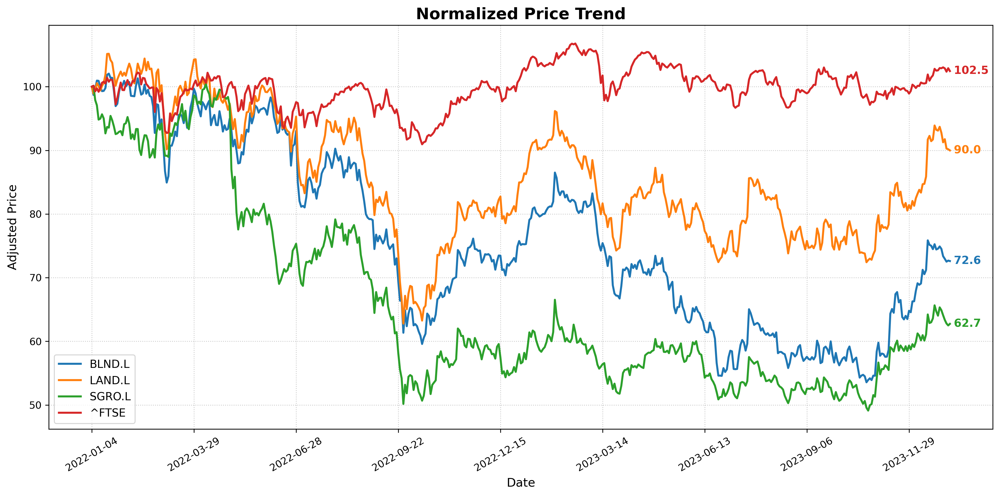
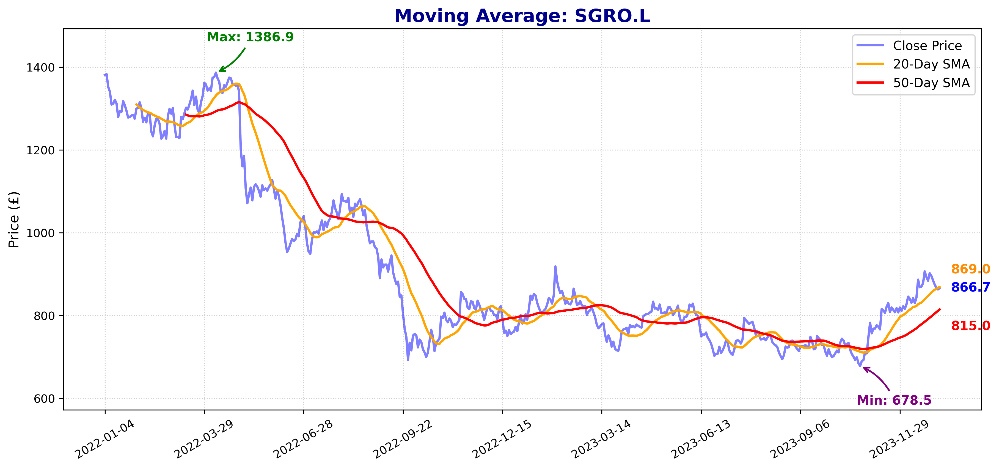
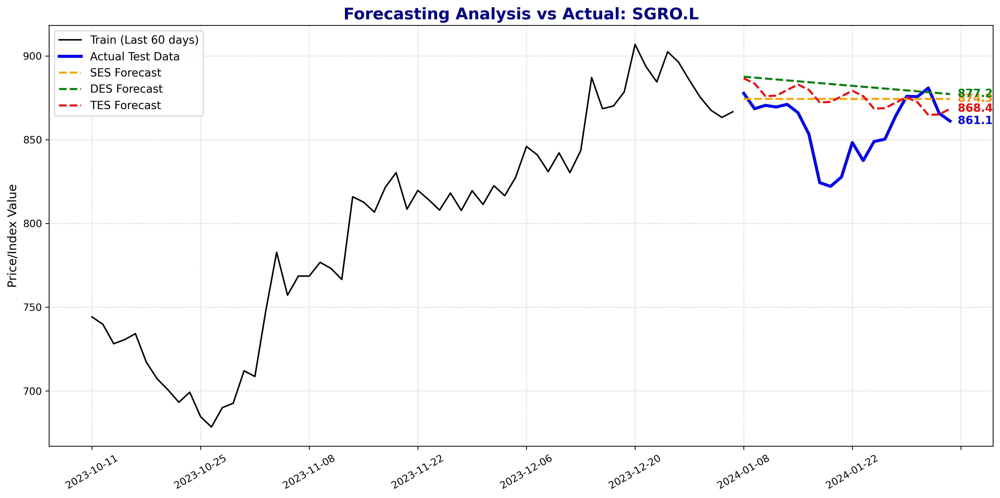
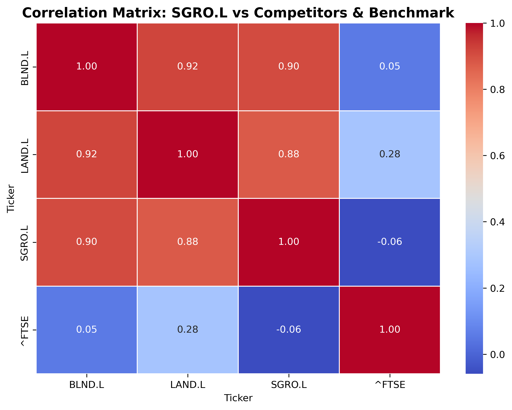

# Stock Market and Fundamental Analysis

A comprehensive financial analysis report examining Segro PLC's stock performance and fundamental metrics compared to industry peers, utilizing Python for data extraction and Excel for financial analysis.

## Project Overview

This report examines the​ stock market analysis and fundamental analysis of Segro, a company specialising in warehouse and logistics properties, from January 2022 to February 2024. It compares Segro with two similar companies, ​Land Securities Group and British Land and​ uses the FTSE 100 ​index as​ the benchmark for the overall market to identify price trends, volatility patterns, and fundamental drivers of stock performance.

### Key Findings

- **Segro fell the sharpest** — down 37.3% (normalized to 62.7), from a peak of 1,386.9p to a trough of 678.5p, versus Landsec (-40.3%) and British Land (-47.5%), while the FTSE 100 stayed broadly flat (+2.5%)
- **Highest risk profile** — Segro recorded the most negative mean daily return (-0.000716) and worst Sharpe ratio (-0.035068), with extreme losses reaching -10%
- **SES was the most accurate forecast** for Segro (MAE 17.61 vs DES 24.69), while DES/TES overestimated by extending the upward trend
- **Driven by sector peers, not the market** — regression R² = 0.60; Landsec (β = 0.501) and British Land (β = 0.333) both significant (p < 0.05), while the FTSE 100 was insignificant and removed
- **Strongest fundamental recovery** — rental income rose 21.4% (£412m → £500m), profit returned to +£636m in 2024 (from a -£1,967m loss in 2022), and LTV fell from 34% to 28%

## Companies Analyzed

| Company | Sector Focus | Ticker |
|---------|-------------|--------|
| **Segro PLC** | Industrial logistics & data centres | SGRO.L |
| **Land Securities Group** | Offices, retail, mixed-use | LAND.L |
| **British Land Group** | Offices, retail, urban logistics | BLND.L |
| **FTSE 100** | Broader market benchmark | ^FTSE |

## Methodology

### Data Sources
- **Historical prices**: Yahoo Finance API (Python)
- **Financial statements**: Company annual reports (2022-2024)
- **Analysis period**: 505 trading days (training) + 20 days (testing)

### Tools & Techniques

**Technical Analysis:**
- Normalized price trends and moving averages (20-day & 50-day SMA)
- Descriptive statistics (mean, median, variance, Sharpe ratio)
- Exponential smoothing forecasts (SES, DES, TES)
- Return distribution analysis (histograms)

**Fundamental Analysis:**
- Net rental income trends
- Profit before tax analysis
- EPRA Net Tangible Assets (NTA) per share
- Loan-to-Value (LTV) ratio & leverage analysis

**Regression Analysis:**
- Multiple linear regression (OLS)
- Correlation matrix analysis
- Relationship investigation between Segro and competitors

## Repository Structure

```
├── README.md                 # Project documentation
├── analysis.ipynb            # Jupyter notebook — full analysis pipeline
└── images.md/                # Charts and visualizations
```

## Analysis Workflow

The notebook (`analysis.ipynb`) covers the full pipeline:

1. **Data extraction** — pull historical prices from Yahoo Finance; split into 505-day training and 20-day test sets
2. **Descriptive analysis** — daily returns, key statistics, return distributions
3. **Trading strategy** — 20-day & 50-day SMA crossover (golden/death cross)
4. **Forecasting** — SES, DES, TES models with MAE/MSE/RMSE accuracy comparison
5. **Relationship investigation** — correlation matrix and OLS regression
6. **Fundamental analysis** — rental income, profit, EPRA NTA, LTV from annual reports

## Visualizations

**Normalized Price Trend** — Segro's deeper relative decline vs peers and the FTSE 100



**Moving Average (Segro)** — golden/death cross signals



**Forecasting Analysis (Segro)** — SES vs DES vs TES against actual prices



**Correlation Matrix** — Segro's strong link to peers, weak link to FTSE



## Key Results

### Price Performance
- **Segro**: 1,387p → 679p → 867p (Recovery signal in 2024)
- **Landsec**: 811p → 484p → 694p (Most resilient)
- **British Land**: 555p → 291p → 395p (Steepest office exposure)
- **FTSE 100**: Stable at ~102.5 normalized baseline

### Forecasting Accuracy (MAE)
| Asset | SES | DES | TES |
|-------|-----|-----|-----|
| Segro | 17.61 ⭐ | 24.69 | 20.08 |
| British Land | 10.43 | 12.41 | 9.71 ⭐ |
| Landsec | 37.53 ⭐ | 44.20 | 39.81 |

### Regression Results (R² = 0.60)
- **Landsec coefficient**: 0.501 (p < 0.05) ✓ Significant
- **British Land coefficient**: 0.333 (p < 0.05) ✓ Significant
- **FTSE 100 coefficient**: Not significant → Removed from final model

**Interpretation**: Segro's returns are driven by property sector dynamics, not the broader market.

### Fundamental Improvements
| Metric | 2022 | 2023 | 2024 | Change |
|--------|------|------|------|--------|
| Rental Income (£m) | 412 | 460 | 500 | +21.4% |
| Profit/Loss (£m) | -1,967 | -263 | +636 | Profit return |
| LTV Ratio | 34% | 31% | 28% | -6pp |
| EPRA NTA/Share (p) | 966 | 907 | 907 | -6.1% |

## Investment Recommendation

**HOLD** – Segro's business fundamentals are improving (rising rental income, reduced debt, return to profitability), but share prices have not yet confirmed a clear upward trend. 

**Consider buying if**:
- Share price shows sustained upward momentum
- Interest rates begin to decline
- Rental growth continues

**Consider selling if**:
- Interest rates rise further
- Valuation pressures intensify
- Fundamental deterioration occurs

---

## Technologies Used

- **Python**: Data extraction, analysis, visualization
  - yfinance (Yahoo Finance API)
  - pandas, numpy (data manipulation)
  - statsmodels (forecasting, regression)
  - matplotlib, seaborn (visualization)
- **Excel**: Financial statement analysis and fundamental metrics
- **Statistical Methods**: OLS regression, exponential smoothing, correlation analysis

## How to Run

1. Install dependencies:
   ```bash
   pip install yfinance pandas numpy matplotlib seaborn statsmodels scikit-learn openpyxl
   ```
2. Open the notebook:
   ```bash
   jupyter notebook analysis.ipynb
   ```
3. Run all cells to extract data, generate charts, and reproduce the analysis
4. Generated charts are saved to the `images.md/` folder

## Limitations & Considerations

- Analysis limited to January 2022 – February 2024 period
- Forecast models cannot predict sudden macroeconomic shocks (e.g., interest rate surprises)
- Regression analysis explains 60% of variance; 40% driven by other factors
- Historical analysis does not guarantee future performance
- Real estate valuations highly sensitive to interest rate changes

## Author

Rachel Nguyen  
Data Visualization and Analytics Assignment

## Date

Report Period: January 2026 – April 2026  

---

**Disclaimer**: This analysis is for educational purposes only and should not be considered as financial advice. Investment decisions should be made after consulting with qualified financial advisors.
